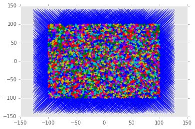
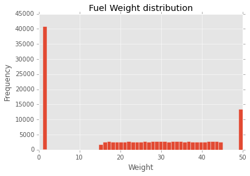
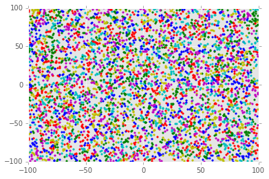
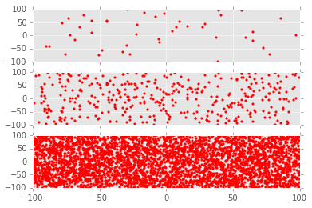
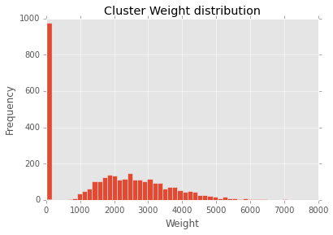

#Data Exploration

##Before we decide which algorithm to use to solve the problem, it is important that we explore the given dataset. These may prove to be quite useful later on.

##Import dataset

    import pandas as pd
    df=pd.read_csv("Breach.csv")
    df.head()

<table border="1" class="dataframe">
  <thead>
    <tr style="text-align: right;">
      <th></th>
      <th>Breach No.</th>
      <th>X coordinate</th>
      <th>Y coordinate</th>
      <th>Fuel weight</th>
    </tr>
  </thead>
  <tbody>
    <tr>
      <th>0</th>
      <td>1</td>
      <td>-8.029643</td>
      <td>71.801356</td>
      <td>1.000000</td>
    </tr>
    <tr>
      <th>1</th>
      <td>2</td>
      <td>-44.971581</td>
      <td>48.637881</td>
      <td>34.719301</td>
    </tr>
    <tr>
      <th>2</th>
      <td>3</td>
      <td>13.046005</td>
      <td>42.814229</td>
      <td>28.918984</td>
    </tr>
    <tr>
      <th>3</th>
      <td>4</td>
      <td>95.201046</td>
      <td>3.213363</td>
      <td>29.463057</td>
    </tr>
    <tr>
      <th>4</th>
      <td>5</td>
      <td>-77.961498</td>
      <td>47.168313</td>
      <td>1.000000</td>
    </tr>
  </tbody>
</table>

    import matplotlib.pyplot as plt
    from matplotlib import style
    style.use('ggplot')
    %matplotlib inline
    import numpy as np
    from sklearn.cluster import KMeans
    
    X=np.array(df.drop(['Breach No.','Fuel weight'],1))

    clf=KMeans(n_clusters=3272,max_iter=1)
    clf.fit(X)

    centroids=clf.cluster_centers_
    labels=clf.labels_
    colors=550*["r.","b.","g.","c.","m.","y."]

    for i in range(10000):
        plt.plot(X[i][0],X[i][1],colors[labels[i]],markersize=5)
    plt.scatter(centroids[:,0],centroids[:,1],marker='x',s=10)

    <matplotlib.collections.PathCollection at 0x1101785f8>

    for i in range(1000):
        plt.plot(X[i][0],X[i][1],colors[labels[i]],markersize=5)
    plt.scatter(centroids[:,0],centroids[:,1],marker='x',s=5)

###The distribution is rather uniform, there are no real clusters

###Minimum clusters required

    k=1
    df['Fuel weight'].sum()/(975*k)

    3271.865938915435

    plt.hist(df['Fuel weight'].tolist(),bins=50)
    plt.title('Fuel Weight distribution')
    plt.xlabel('Weight')
    plt.ylabel('Frequency')

    <matplotlib.text.Text at 0x3206afd0>

###Weight distribution is uniform in the mid region and high for weights = 1 and 50

    for i in range(5000):
        plt.plot(X[i][0],X[i][1],colors[labels[i]],markersize=5)

###Points are uniformly distributed

    Y=np.array(df.drop(['Breach No.'],1))

    count=0
    for i in range(len(Y)):
        if(Y[i][2]<10 or Y[i][2]>45):
            count=count+1
    print (100*count)/len(Y)
    

    39
    

    f,axarr = plt.subplots(3, sharex=True)
    for i in range(100):
        if(Y[i][2]<10 or Y[i][2]>45):
            count=count+1
            axarr[0].plot(Y[i][0],Y[i][1],"r.",markersize=5)
    for i in range(1000):
        if(Y[i][2]<10 or Y[i][2]>45):
            count=count+1
            axarr[1].plot(Y[i][0],Y[i][1],"r.",markersize=5)
    for i in range(10000):
        if(Y[i][2]<10 or Y[i][2]>45):
            count=count+1
            axarr[2].plot(Y[i][0],Y[i][1],"r.",markersize=5)

###The points of weight = 1 or 50 are also uniformly distributed

    cluster_weights=[0]*3272

    Z=np.array(df.drop(['Breach No.'],1))
    for i in range(len(X)):
        cluster_weights[labels[i]]=cluster_weights[labels[i]]+Z[labels[i]][2]
    plt.hist(cluster_weights,bins=50)
    plt.title('Cluster Weight distribution')
    plt.xlabel('Weight')
    plt.ylabel('Frequency')

    <matplotlib.text.Text at 0x11a0fab70>

    ctr=0
    for i in cluster_weights:
        if(i>975):
            ctr=ctr+1
    print ctr;

    2274
    

###Most clusters exceed the 975 capacity mark using the normal Kmeans algorithm
